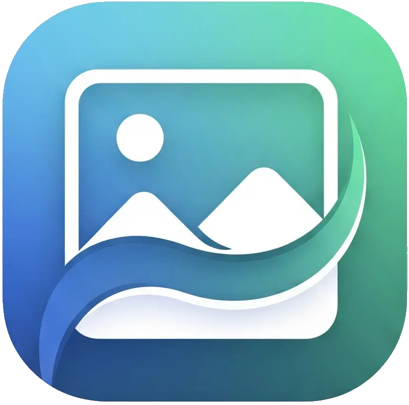

## ✨ This is Smoozoo


A super-smooth, performant and modern image viewer for the web.  
Made for very large images that require fast navigation and scaling.  

### Bigger features
- Feels good, man.
- GPU scaling using WebGL with mipmapping and frustum culling
- No third party dependencies

### Other features
- Plain Javascript, no nonsense (hi Giel)
- Minimap navigator
- Plugin support
- Desktop-first but very mobile-friendly
- File loader & drag/drop of files

### Usage
- Keyboard
    - `Home`  
        Quickly go to left part of image  
    - `End`  
        Quickly go to right  
    - `Page Up`  
        Quickly go to top  
    - `Page Down`  
        Quickly go to bottom  
    - `m`  
        Toggle UI visibility  
    - `p`  
        Toggle texture filtering (don't blur my pixels)  
    - `c`  
        Copy a link that leads to location currently under 
        mouse pointer. E.g. http://oobabooga.com/smoozoo/?x=20000&y=0&scale=5&animate=true


- Mouse  
    - `Double-click with a mouse`  
        quickly toggle scale of 0.25 or 1.  
    - `Mousewheel`  
        Quickly zoom in/out  
    - `Left mouse button`  
        Drag to pan image  
    - `Left mouse button on marker/circle`  
        Sticky the popup  

- Mobile
    - `Single tap`  
        Toggle visibility of UI  
    - `Pinch`  
        Zoom  
    - `Flick`  
        Moves with a glide
    - `Move`  
        Pan

- Navigation misc  
    - `Slider`  
        Sideway navigation only (useful for very wide and not very tall images)  
    - `Minimap`  
        Use mouse/finger on minimap to move viewport in all directions (depending on zoom level)  

### Demo
It's a pretty low-end host, depending on load, image might take a few seconds or two to load.

https://oobabooga.com/smoozoo/default.html  
or
https://oobabooga.com/smoozoo/wurm-map.html  


### About
I originally built Smoozoo (it did not have a name) for another project 
using a basic 2D canvas and simple scaling — it started small and wasn’t
meant to become a ... project, but handling large images quickly became
painfully slow. And now we're here.

You'll be surprised how much code is needed to make a user experience that
feels this way. I know I am.

The feel is inspired by Windows 10/11's default image viewer. We're not
quite done yet, but, this actually already feels _better_ than Windows
native one (I humbly opine)!

## TODO
    - add support for showing a lower quality picture while loading,
      for instance, a .webp can be quickly loaded compared to a png
      of 15 MB (compress/convert with https://squoosh.app)

    - set up github build-action for Tauri -- or _possibly_ a local
      cross-compile to Windows ... or both. yes. both.

    - the minimap viewport border goes below the minimap edge

    - add a method to smoothly pan/scale from current point to another

    - When I deep-link to a position, I end up ignoring what is allowed to be 
      maximum zoomed-out. I will want to still do that calculation even if we
      are not using it initially (basically, I cannot zoom out as far as I want)

    - There seems to be some kind of acceleration/momentum issue when you flick
      the view with mouse. Perhaps it happens when you flick and we are already
      gliding? Or some multiplier going awry in momentum if we already have some?
      Sometimes it pans very fast at least.

    - Code is in one large file now. It used to be a small file. Split things up a bit.
      Although personally, I am a fan of a single large file!

    - FIX (or ditch): 'r' to rotate image in steps of 90 degrees

    - For demo purposes: Be able to set which plugins should be loaded with which image?
      Or not? Just create several initializations?

    - Cosmetics:  
        - make GL clear color configurable  

## Use Smoozoo in your own projects
See `examples/index.html`, but this is pretty much what you need, depending on which
plugins you have enabled:
```html
<!DOCTYPE html>
<html lang="en">
    <head>
        <meta charset="UTF-8">
        <title>Smoozoo - Image Viewer</title>

        <meta name="viewport" content="width=device-width, initial-scale=1" />
        
        <link rel="stylesheet" href="../css/smoozoo.css" />
        <link rel="stylesheet" href="../plugins/smoozoo-plugin-minimap.css" />
        <link rel="stylesheet" href="../plugins/smoozoo-plugin-filechooser.css" />

        <script type="module" src="../js/smoozoo.js"></script>
        <script type="module" src="../js/index.js"></script>
    </head>
    <body>
        <canvas id="smoozoo-glcanvas"></canvas>
    </body>
</html>
```

Then start Smoozoo like this (in e.g. `index.js`):
```javascript
import { MinimapPlugin } from "../plugins/smoozoo-plugin-minimap.js";
import { FileChooserPlugin } from "../plugins/smoozoo-plugin-filechooser.js";

window.addEventListener('load', async () => {
    const settings = {
        canvas:                     document.getElementById('smoozoo-glcanvas'),
        backgroundColor:            "#0e0422",
        initialScale:               0.3,
        initialPosition:            { x: 0.0, y: 0.5 },
        loadingAnimation:           true,
        maxScale:                   40,
        elasticMoveDuration:        200,
        zoomStiffness:              15,
        mouseInertiaFriction:       0.95,
        touchInertiaFriction:       0.98,
        inertiaStopThreshold:       0.1,
        windowResizeDebounce:       100,
        animateDeepLinks:           true,
        allowDeepLinks:             true,   // Allow going to e.g. ?x=2777&y=1879&scale=20.000000
        pixelatedZoom:              true,   // Can also be toggled with p, or overridden with dynamic below
        dynamicFilteringThreshold:  2.0,    // The scale where we toggle filtering (if enabled)
        dynamicTextureFiltering:    true,   // If greater or less than dynamicFilteringThreshold,
                                            // automatically toggle texture filtering (pixelated or not)
        plugins: [
            // any plugins you might have -- see below for more information.
        ]
    };

    // URL object is used so that Parcel can easily find the asset.
    const url = new URL(`../assets/some-image.png`, import.meta.url);
    smoozoo(url.toString(), settings);
});
```

### Testing & Building
Test/development (hot re-loading):
```bash
npm run test
```
You can find test files hosted e.g. here:  
- http://localhost:1234/default.html  
- http://localhost:1234/wurm-map.html  


Building:
```bash
npm run build
```
The build ends up in `dist`.

Alternatively, if you want to build examples too:
```bash
npm run buildall
```


## Plugins
The Viewer API gets expanded with what I need, as I need it. Feel free to expand upon it yourself.

That said ...

Your plugin consists of two files, if you have extra CSS, include the file in your HTML page:
```html
<link rel="stylesheet" href="./plugins/smoozoo-plugin-yours.css" />
```

Then you need to have the code somewhere. So, this .js file should export a class which will
be instantiated by Smoozoo on startup.

You only have to declare the methods you need.

As a brief example:
```javascript
export class YourSmoozooPlugin
{
    /**
     * viewer 
     * is your proxy to the API of Smoozoo
     * 
     * options
     * is an object you pass in via settings when you instantiate Smoozoo
     * 
     * containerElement
     * html element adjacent to the primary viewer canvas. This is typically
     * where you would inject your plugin's HTML fragment(s).
     */
    constructor(viewer, options, containerElement)
    {
    }

    /**
     * Called by Smoozoo on every render(), and 
     * once right after instantiating the plugin.
     */
    update()
    {
    }

    /**
     * Called when mouse moves over canvas
     */
    onMouseMove(e)
    {
    }

    /**
     * Called after a new image was loaded and made into tiles
     */
    onImageLoaded()
    {
    }

    /**
     * For those moments when you have a touchable element above
     * the canvas and want to prevent canvas from stealing the event.
     */
    mayTouchStartOnCanvas(e)
    {
        return true;
    }
}
```

So, to make it all come together. When you configure Smoozoo, give it your plugin.

Like so:
```javascript
import { YourSmoozooPlugin } from "../plugins/smoozoo-plugin-yours.js";

const settings = {
    ...other smoozoo settings here...,
    plugins: [
        {
            name:    YourSmoozooPlugin,
            options: {
                anything: await (await fetch(`./assets/BTCUSDT.json`)).json(),
                youwant: true,
                goes: "here",
            }
        }
    ]
};

const url = new URL(`../assets/some-image.png`, import.meta.url);
smoozoo(url.toString(), settings);
```

### Plugin API
This is the API you get access to via `viewer` in your plugin's constructor. As
stated before, it is very sparse at the moment. More will come as needed, feel
free to expand it.

This is how the API that is passed to plugins is instantiated at the moment:
```javascript
const viewerApi = {
    getTransform: () => ({ scale, originX, originY }),
    getCanvas: () => canvas,
    getTiles: () => tiles,
    getImageSize: getCurrentImageSize,
    requestRender: render,
    jumpToOrigin: jumpToOrigin,
    cancelAllAnimations: cancelAllAnimations,
    renderToPixels: renderToPixels,
    renderToPixelsAsync: renderToPixelsAsync,
    loadImage: loadImage,
    animateTo: animateTo, // e.g.: animateTo({ x: 10500, y: 500, scale: 2, duration: 1500, easing: "easeInOutCubic" });
    currentImageUrl: () => currentImageUrl,
    currentImageFilename: currentImageUrl.split('/').pop()
};
```

## Existing plugins
There are a few.

### 1. Hotspot plugin
This enables associating additional information in a popup with a pixel position in the underlying image.  
E.g. with a radius of 20 at position 150,210, show this popup when hovered. It supports clustering so
that, e.g. 100 markers will become one if zoomed out.  

Enable it in settings:
```javascript
const settings = {
    ...,
    plugins: [
        {
            name:     HotspotPlugin,
            instance: null,
            options: {
                // A bit of ugliness to get Parcel to pick up the asset.
                hotspots: await (await fetch( new URL(`../assets/ETHUSDT-ath.json`, import.meta.url).toString() )).json(),
                objectType: "ATHs"  // Just a name of your choice, can be left empty too
            }
        }
    ]
}
```

The format of the `JSON` used for this plugin is this:
```json
[
    {
        "id": "at-1746277307000",
        "x": 1358,
        "y": 1060,
        "radius": 2,
        "content": {
            "title": "Some title",
            "subtitle": "actually shows up in footer of popup",
            "text": "text content of popup",
            "image": null
        }
    },
    ... more entries ...
]
```

### 2. Overlay Example plugin
It is meant for you to base your own plugins on, but it will still output some test-shapes
for testing.

Include it in Smoozoo like so:
```javascript
import { OverlayBasePlugin } from "../plugins/smoozoo-plugin-overlay-base.js";

const settings = {
    ...,
    plugins: [
        {
            name: OverlayBasePlugin,
            options: {
                hoverOutlineColor: "yellow",
                // These values are used if text-shape omit any (reduces data transfer, in case of alot)
                defaultTextFontSize: 14,
                defaultTextFontFamily: "sans-serif",
                defaultTextFontColor: "#888",
                defaultTextBackground: undefined,
                shapes: null, // An explicit `null` here will show some default test shapes. See as documentation.
            }
        },
    ]
}
```

### 3. Minimap plugin
Include in your settings like this:

```javascript
import { MinimapPlugin } from "../plugins/smoozoo-plugin-minimap.js";

const settings = {
    ...,
    plugins: [
        {
            name: MinimapPlugin,
            options: {
                minimapMinSize: 0,
                minimapMaxSize: 200
            }
        }
    ]
}
```

### 4. Filechooser plugin

Enable loading of files via these means:
- Load from computer
- Load from preset list (passed in in settings)
- Drag and drop file from your computer to the browser

Include the plugin in your settings like this:
```javascript
const settings = {
    ...,
    plugins: [
        {
            name: FileChooserPlugin,
            options: {
                presetFiles: [
                    { name: 'Xanadu',  url: new URL(`../assets/xanadu-reconstruction.png`, import.meta.url).toString() },
                    { name: 'Arathok',  url: new URL(`../assets/ara-map.png`, import.meta.url).toString() },
                    { name: 'BTC-USDT', url: new URL(`../assets/BTCUSDT.png`, import.meta.url).toString() },
                    { name: 'ETH-USDT ATH', url: new URL(`../assets/ETHUSDT-ath.png`, import.meta.url).toString() },
                    { name: 'BTC-USDT ATH', url: new URL(`../assets/BTCUSDT-ath.png`, import.meta.url).toString() },
                ]
            }
        }
    ]
}
```
The muckery with new URL() is primarily for Parcel to know that it should include the image
in the distribution. You can just pass in a string as URL.


### 5. Wurm Map Viewer
It is compatible with Jonneh's map-viewer, you just need to include the script
called `config.js`. Deeds and focusZones will be picked up automatically by
this plugin after that.

There is a demo for this in `examples`: `wurm-map.html` and `wurm-map.js`.

But in short, in your HTML:
```html
<!-- This is just for a simple test I decided to play with: compatibility with a Wurm map-viewer -->
<script type="text/javascript" src="./assets/zenath-mapviewerconfig.js"></script>
```

To use, `index.js`:
```javascript
import { WurmMapPlugin } from "../plugins/smoozoo-plugin-wurm-map.js";

window.addEventListener('load', async () => {
    const settings = {
        canvas: document.getElementById('smoozoo-glcanvas'),
        backgroundColor: "#0e0422",
        loadingAnimation: false,
        allowDeepLinks: true,
        // ...other smoozoo settings...,
        plugins: [
            {
                // You want to include this plugin if you want to be able to switch views (flat/3d/etc)
                name: FileChooserPlugin,
                options: {
                    allowFileDrop: false,
                    showFileList: true,
                    showFileDialog: false,
                    presetFiles: [
                        { name: 'Zenath PvE',       url: new URL(`../assets/zenath-pve.png`,      import.meta.url).toString() },
                        { name: 'Zenath PvE 3D',    url: new URL(`../assets/zenath-pve-3d.png`,   import.meta.url).toString() },
                        { name: 'Zenath PvE roads', url: new URL(`../assets/zenath-pve-road.png`, import.meta.url).toString() },
                    ]
                }
            },
            {
                // Always nice to have a minimap
                name: MinimapPlugin,
                options: {
                    minimapMinSize: 0,
                    minimapMaxSize: 200
                }
            },
            {
                // The Wurm map-viewer is very little code, not much to configure.
                // It's pretty basic, give it your own twist.
                name: WurmMapPlugin,
                options: {
                }
            },
        ]        
    }

    const url = new URL(`../assets/zenath-pve.png`, import.meta.url);
    smoozoo(url.toString(), settings);
});
```


## Maybe TODO
    - "Tiled pyramid" format (like DZI - Deep Zoom Image). Support for pre-sliced tiles at
      different scales from back-end (low priority as it needs server side code).

    - Check screenwidth and decide based on that if we should load a smaller version of the image.
      (would need server-side code, not currently interested)

    - Make smoozoo an electron app (or similar): I want it as default image viewer in Windows
        - in this case, need it to do video too hum.

    - expand on interface to interact with the viewer in another porject

    - document how to include/use this without Parcel (just a matter of including scripts in html)

## Maybe future plugins
    - picture collection / gallery plugin (call it collection, tho -- a gallery sounds
      very grandiose)
        - zoom in the collection just as with a single image -- but this time then all
          images in the gallery
        - flick/pan/glide/ellastic scrolling (also just like in image)
        - be able to select multiple by dragging over them
        - plugin interface to perform an action on selected images
        - can point it at a set of images or a folder
        - ability to tag images (just throw the db in local storage)

    - on charts:
        - live update of "images" (think charts) - but this is a bit awkward, the imageviewer
          should not be the one in control. The chart should be. Probably. 

        - not for in here, but I would like chartjs to generate base64-encoded images for the
          inline'd minute-charts
    
    - "smart" conversion of images to dark mode
    
    - ability to set brightness / contrast / saturation - maybe other adjustments

	- we already support some meta-data via plugin but I'd like to extend that so that
      depending on position of viewport it should show/pin messages to that pixel as we
      pan/zoom around it

    - be able to set a title of an image (through some meta data)

    - save image; incl. whatever plugins did -- would need some way to say which elements
      are part of the image (in the case of overlay canvases and similar)

    - manual annotation on a separate canvas (i.e. simple drawing -- or minipaint?)

    - set up an intermediate layer to allow MiniPaint to be used for drawing on overlay
      file:///K:/development/2023/miniPaint/index.html
